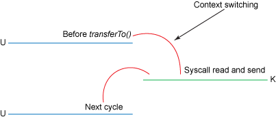

# Building Realtime & Big Data Pipelines with Apache Kafka

---
# Radosław Szmit
@fa[twitter] @RadoslawSzmit  
@fa[globe] http://bigdatapassion.pl/  
@fa[envelope] radoslaw.szmit@gmail.com  

---
### Czy jest Apache Kafka?
Apache Kafka® is a distributed streaming platform

---
### Czy jest Apache Kafka?
* Kolejka danych (Publish + Subscribe)
* Rozproszona “baza danych” (distributed commit log)
* Przetwarzanie strumieniowe danych

---
### Zastosowania
* Narzędzie do efektywnego strumieniowego przesyłania danych pomiędzy systemami i aplikacjami 
* Narzędzie do przetwarzania strumieni danych
* Narzędzie do reagowania na zdarzenia

---
### Zastosowania

---
### Cechy
* Narzędzie (niemal) czasu rzeczywistego
* Narzędzie Big Data (terabajty danych, miliony zdarzeń na sekundę)

---
### Popularność w świecie Big Data

https://medium.com/@joecrobak/five-years-of-hadoop-weekly-7aa8994f140b

---
### Kafka API

@div[left-50]

@divend

@div[right-50]
@ul[white]
- Producer API
- Consumer API
- Streams API
- Connect API
- AdminClient API
- Legacy API (old)
@ulend
@divend

---
### Klienci Kafka
* Zespół Apache Kafka utrzymuje i rozwija bibliotekę kliencką dla języka **Java**
* Dostępne są klienci "community" dla innych języków: C/C++, Python, Go (AKA golang), Erlang, .NET, Clojure, Ruby, Node.js, Proxy (HTTP REST, etc), Perl, stdin/stdout, PHP, Rust, Alternative Java, Storm, Scala DSL, Clojure, Swift etc.

---
### Ekosystem
* Integruje się z wieloma narzędziami: Hadoop, Flume, JDBC, Elasticsearch, Presto, Hive, Camel etc.
* Integracja z narzędziemi do przetwarzania strumieniowego: Spark, Storm, Samza, Flink, Apex, Spring Cloud Stream etc.
* Dystrybucje Big Data (Cloudera, Hortonworks)
* Integracja z AWS

---
### Kafka Logs

---
### Partycje

---
### Grupy konsumentów

---
### Zero-copy
"Zero-copy" describes computer operations in which the CPU does not perform the task of copying data from one memory area to another. This is frequently used to save CPU cycles and memory bandwidth when transmitting a file over a network. Wikipedia

---
### Data copying

@div[left-50 fragment]

@divend

@div[right-50 fragment]

@divend

https://www.ibm.com/developerworks/library/j-zerocopy/index.html

---
### Context switching

@div[left-50 fragment]

@divend

@div[right-50 fragment]

@divend

https://www.ibm.com/developerworks/library/j-zerocopy/index.html

---
### Producer API
~~~java
Properties producerConfig = new Properties();
producerConfig.put(ProducerConfig.BOOTSTRAP_SERVERS_CONFIG, KAFKA_SERVER);
producerConfig.put(ProducerConfig.ACKS_CONFIG, "all");
producerConfig.put(ProducerConfig.RETRIES_CONFIG, 0);
producerConfig.put(ProducerConfig.VALUE_SERIALIZER_CLASS_CONFIG, StringSerializer.class.getCanonicalName());
producerConfig.put(ProducerConfig.KEY_SERIALIZER_CLASS_CONFIG, StringSerializer.class.getCanonicalName());

Producer<String, String> producer = new KafkaProducer<>(producerConfig);

ProducerRecord<String, String> data = new ProducerRecord<>(TOPIC, MESSAGE_ID, "Message text...");
producer.send(data);
~~~
@[1-6](Konfiguracja)
@[8](Kafka producent)
@[10](Rekord wiadomośći (klucz - wartość))
@[11](Wysłanie wiadomości)

---
### Consumer API
~~~java
Properties consumerConfig = new Properties();
consumerConfig.put(ConsumerConfig.BOOTSTRAP_SERVERS_CONFIG, KAFKA_SERVER);
consumerConfig.put(ConsumerConfig.GROUP_ID_CONFIG, "group-name");
consumerConfig.put(ConsumerConfig.AUTO_OFFSET_RESET_CONFIG, "earliest");
consumerConfig.put(ConsumerConfig.VALUE_DESERIALIZER_CLASS_CONFIG, StringDeserializer.class.getCanonicalName());
consumerConfig.put(ConsumerConfig.KEY_DESERIALIZER_CLASS_CONFIG, StringDeserializer.class.getCanonicalName());

KafkaConsumer<String, String> consumer = new KafkaConsumer<>(consumerConfig);
consumer.subscribe(Collections.singletonList(TOPIC));

ConsumerRecords<String, String> records = consumer.poll(TIMEOUT);

if (records.count() > 0) {
    LOGGER.info("Poll records: " + records.count());

    for (ConsumerRecord<String, String> record : records) {
        System.out.printf("Received Message topic = %s, partition = %s, offset = %d, key = %s, value = %s\n",
        record.topic(), record.partition(), record.offset(), record.key(), record.value());
    }
}

consumer.commitAsync();
~~~
@[1-6](Konfiguracja)
@[8](Kafka konsument)
@[9](Subskrybcja do kolejki)
@[11](Pobranie wiadomości z topicu)
@[13-20](Pobranie wiadomości z topicu)
@[22](Offsets commit)

---
# Pytania?